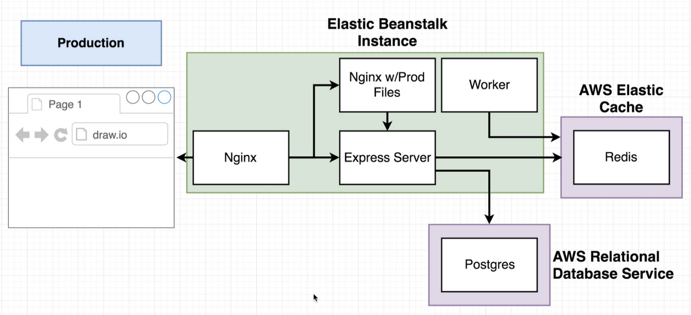

docker build -f Dockerfile.dev . 

# Fibonacci Sequence App

This is a multi-container app that provides a web interface to calculate the Fibonacci sequence. The app consists of a React client, an Express API, a Node worker, Redis, and Postgres database. It is designed to be deployed on AWS Elastic Beanstalk.
It is purposefully overcomplicated in order to show a multi container production ready app design.



## Prerequisites

Before you can run this app, you will need to install the following dependencies:

    Docker
    Docker Compose

## Running the App

To run the app, you will need to follow these steps:

   - Clone the repository to your local machine.
   - Navigate to the root directory of the project in your terminal.
   - Run the following command to start the app:

``` 
docker-compose -f docker-compose.dev.yml up
 ```

- Once the containers are running, open your web browser and go to http://localhost:3000.
- Make a change in the repo and push it. Github workflow will be triggered and the app will be deployed to AWS Elastic Beanstalk.

## How to Use the App

To use the app, simply enter an index number into the input field and click the "Submit" button. The app will then calculate the Fibonacci number for the given index and display it on the page. The app will also store the result in the Postgres database and cache it in Redis for faster retrieval in the future.